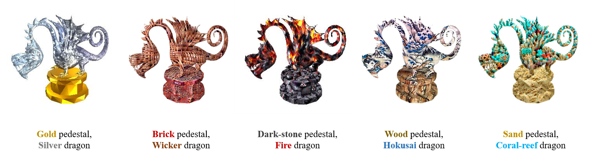
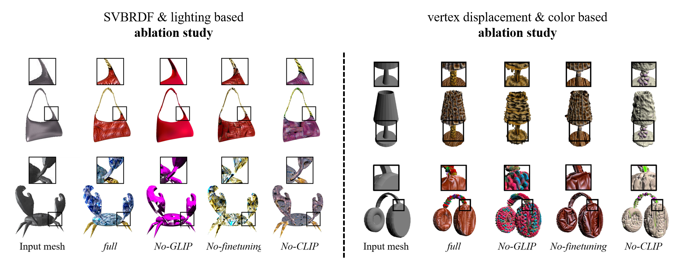
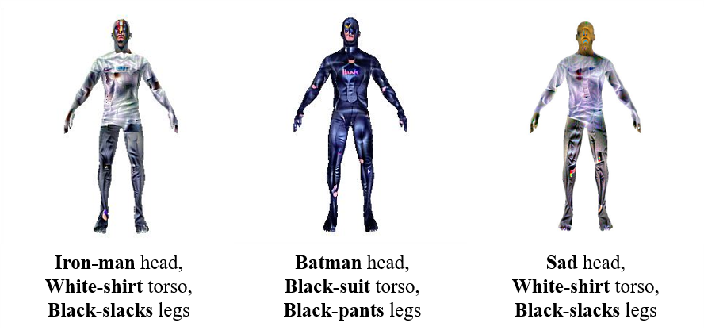

# 3DStyleGLIP: Part-Tailored Text-Guided 3D Neural Stylization

**3DStyleGLIP** is a method specifically designed for text-driven, part-tailored 3D stylization. Given a 3D mesh and a text prompt, 3DStyleGLIP utilizes the vision-language embedding space of the Grounded Language-Image Pre-training (GLIP) model to localize individual parts of the 3D mesh and modify their appearance to match the styles specified in the text prompt. 3DStyleGLIP effectively integrates part localization and stylization guidance within GLIP’s shared embedding space through an end-to-end process, enabled by part-level style loss and two complementary learning techniques.

## Instruction
* Our GLIP folder only contains the code files that need to be modified from the original GitHub code. Please make sure to first obtain GLIP from the official GLIP GitHub repository, and then replace the code files accordingly. [GLIP GitHub](https://github.com/microsoft/GLIP)

* We provide fine-tuned parameter files for the demo, but for stylization of new mesh types, please make sure to perform fine-tuning of GLIP. For details on fine-tuning GLIP, please refer to the GLIP code. Please contact us at **teclados078@khu.ac.kr** for requests regarding the demo parameter files.

## Neural Stylization
### SVBRDF & lighting based method

### Vertex displacement & color based method

## Several Results
### Artistic styles of bags

### Various styles of dragons

## Ablation Study
Results of ablation study (Full, without GLIP, without finetuning, without CLIP)

## Limitations
Limited results of human with parts defined by texts that convey feelings or abstract concepts
