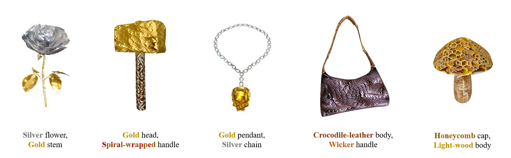
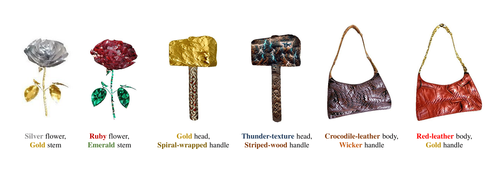
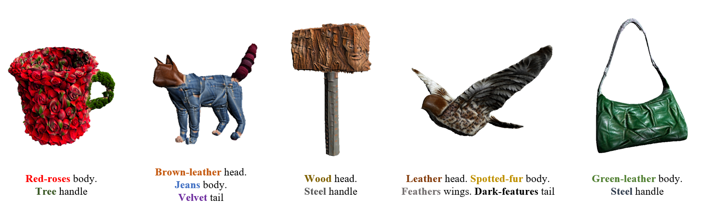
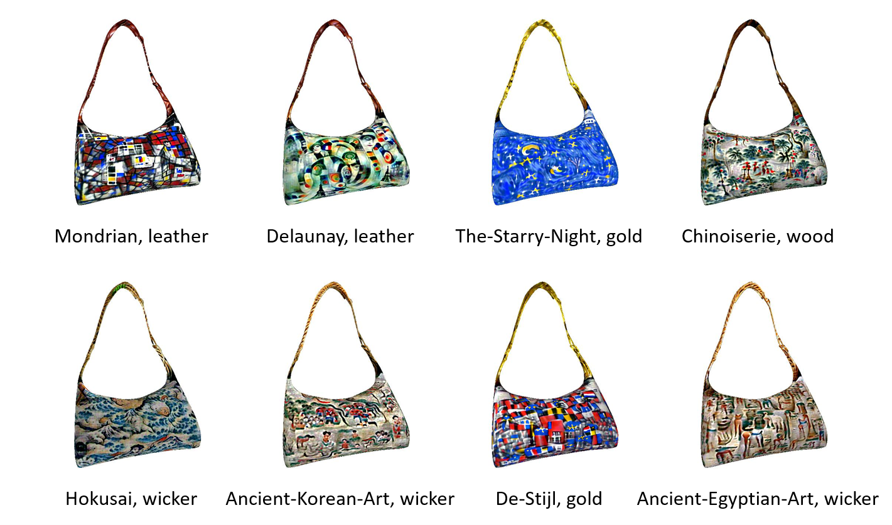
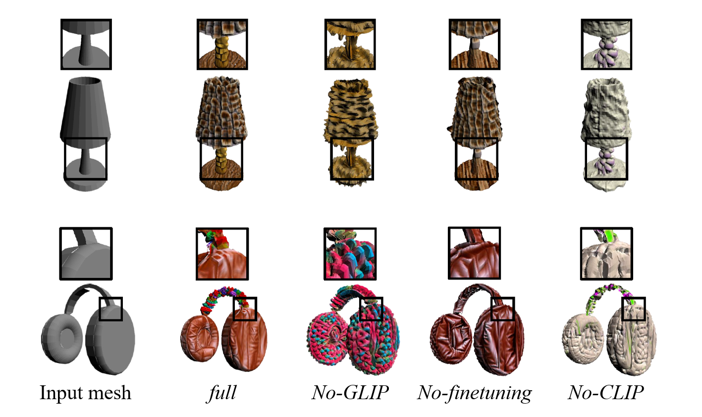
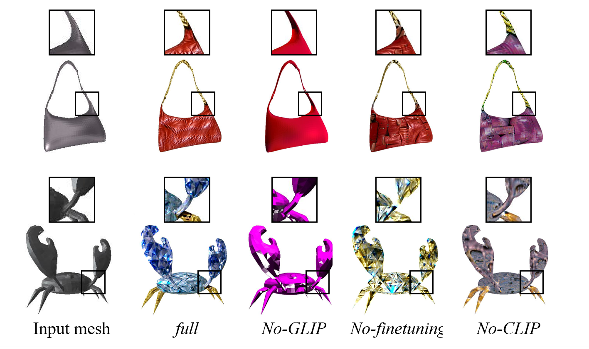

# 3DStyleGLIP: Part-Tailored Text-Guided 3D Neural Stylization

**3DStyleGLIP** is a method specifically designed for text-driven, part-tailored 3D stylization. Given a 3D mesh and a text prompt, 3DStyleGLIP utilizes the vision-language embedding space of the Grounded Language-Image Pre-training (GLIP) model to localize individual parts of the 3D mesh and modify their appearance to match the styles specified in the text prompt. 3DStyleGLIP effectively integrates part localization and stylization guidance within GLIP’s shared embedding space through an end-to-end process, enabled by part-level style loss and two complementary learning techniques.

## Instruction
### Coming Soon

## Neural Stylization
### SVBRDF & lighting based method

### Vertex displacement & color based method

## Several Results
### Artistic bags

### Complex objects

### limitations

## Ablation Study

